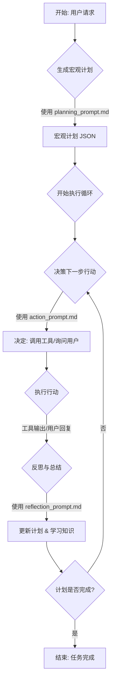

# 智能求职经纪人：核心运作循环（详细设计）

此设计方案的核心是一个名为 `JobSearchTask` 的类，它封装了为单个用户完成一次完整求职任务的所有逻辑和状态。其运作遵循与 Cline 类似的“思考-行动”循环。

## 1. 任务状态机 (Task State Machine)

`JobSearchTask` 的生命周期可以通过一个简单的状态机来管理，这有助于跟踪任务进度和处理异常。

-   `INITIALIZING`: 任务实例已创建，正在加载用户画像和配置。
-   `THINKING`: 正在构建提示词并准备调用 LLM。
-   `AWAITING_LLM_RESPONSE`: 已将请求发送给 LLM，正在等待响应流。
-   `EXECUTING_TOOL`: 正在执行 LLM 指定的工具。
-   `FINISHED`: 任务成功完成（调用了 `system.finish()`）。
-   `FAILED`: 任务因错误（如连续工具执行失败、LLM 无法理解）而终止。

## 2. 实时状态通知 (Real-time Status Notification)

为了让请求端能实时了解任务进展，`JobSearchTask` 在执行过程中会通过一个 `StatusNotifier` 组件，以**流式 HTTP (Chunked Transfer Encoding)** 的形式向外推送状态更新。这种方式比 SSE 更加灵活，不依赖于浏览器的 `EventSource` API，适用于任何 HTTP 客户端。

#### 协议说明

-   **HTTP 响应头**: 服务器设置 `Transfer-Encoding: chunked` 和 `Content-Type: application/x-ndjson`（换行分隔的 JSON）
-   **数据格式**: 每个状态更新都是一个独立的 JSON 对象，以换行符 (`\n`) 结尾
-   **流式传输**: 服务器在任务执行过程中持续向响应流中写入状态更新，直到任务完成

#### 事件格式

每个状态更新都是一个 JSON 对象，直接写入 HTTP 响应流：

```json
{"eventType": "task_state_changed", "timestamp": "2025-01-07T01:00:00Z", "data": {"newState": "THINKING", "message": "正在分析下一步行动..."}}
{"eventType": "thinking_started", "timestamp": "2025-01-07T01:00:05Z", "data": {"message": "正在调用大语言模型进行思考..."}}
{"eventType": "thinking_ended", "timestamp": "2025-01-07T01:00:15Z", "data": {"thinking": "我需要先打开LinkedIn搜索页面"}}
```

常见的 `eventType` 包括：

-   `task_started`: 任务已开始
-   `state_changed`: 任务状态机发生变更
-   `thinking_started`: 开始调用 LLM
-   `thinking_ended`: LLM 返回了思考过程
-   `tool_started`: 开始执行工具
-   `tool_ended`: 工具执行完毕，返回结果
-   `task_finished`: 任务成功结束
-   `task_failed`: 任务失败

#### StatusNotifier 实现示例

```typescript
class StatusNotifier {
  private response: Response; // HTTP 响应对象
  private writer: WritableStreamDefaultWriter;

  constructor(response: Response) {
    this.response = response;
    // 设置响应头
    this.response.headers.set('Transfer-Encoding', 'chunked');
    this.response.headers.set('Content-Type', 'application/x-ndjson');
    this.response.headers.set('Cache-Control', 'no-cache');
    
    // 获取响应流的写入器
    this.writer = this.response.body.getWriter();
  }

  async notify(eventType: string, data: any) {
    const event = {
      eventType,
      timestamp: new Date().toISOString(),
      data
    };
    
    // 将 JSON 对象序列化并添加换行符
    const chunk = JSON.stringify(event) + '\n';
    
    // 写入响应流
    await this.writer.write(new TextEncoder().encode(chunk));
  }

  async close() {
    await this.writer.close();
  }
}
```

#### 客户端接收示例

客户端可以使用 `fetch` API 来接收流式响应：

```javascript
async function startJobSearch(userProfile, jobPreferences) {
  const response = await fetch('/api/job-search', {
    method: 'POST',
    headers: { 'Content-Type': 'application/json' },
    body: JSON.stringify({ userProfile, jobPreferences })
  });

  const reader = response.body.getReader();
  const decoder = new TextDecoder();
  let buffer = '';

  while (true) {
    const { done, value } = await reader.read();
    if (done) break;

    // 将接收到的字节解码为字符串
    buffer += decoder.decode(value, { stream: true });
    
    // 按行分割处理
    const lines = buffer.split('\n');
    buffer = lines.pop(); // 保留最后一个不完整的行

    for (const line of lines) {
      if (line.trim()) {
        try {
          const event = JSON.parse(line);
          handleStatusUpdate(event);
        } catch (e) {
          console.error('解析状态更新失败:', e);
        }
      }
    }
  }
}

function handleStatusUpdate(event) {
  switch (event.eventType) {
    case 'state_changed':
      console.log(`状态变更: ${event.data.newState} - ${event.data.message}`);
      break;
    case 'thinking_ended':
      console.log(`AI 思考: ${event.data.thinking}`);
      break;
    case 'tool_ended':
      console.log(`工具执行完毕: ${event.data.toolCode}`);
      break;
    case 'task_finished':
      console.log('任务完成:', event.data.result);
      break;
    // ... 处理其他事件类型
  }
}

## 3. 任务的启动 (Initiation)

当用户提交他们的个人简历（或简历信息的结构化数据）和求职偏好（如职位、地点、薪资期望）后，系统会创建一个 `JobSearchTask` 实例。这个任务的目标非常明确：**根据用户偏好，在各大招聘网站上寻找并筛选出最匹配的职位列表**。

## 4. 思考 (Think) 阶段

这是智能经纪人决定“下一步做什么”的阶段。它会构建一个精密的提示（Prompt）发送给大语言模型（LLM）。

#### 提示词结构示例

发送给 LLM 的最终提示词将如下结构化：

```
<system_prompt>
你是一个专业的、不知疲倦的 AI 求职顾问...（完整的系统提示）
</system_prompt>

<user_profile>
### 简历摘要
- 技能: Python, JavaScript, AWS, Docker
- 经验: 5年后端开发经验
### 求职偏好
- 职位: Senior Software Engineer, Backend
- 地点: Remote
- 薪资: > $150,000 USD
</user_profile>

<world_knowledge>
### 招聘网站列表
- https://www.linkedin.com/jobs
- https://www.indeed.com
- https://www.glassdoor.com/Job/index.htm
</world_knowledge>

<scratchpad>
你刚刚抓取了以下职位列表，请根据用户偏好进行筛选和分析：
[...从 scrape_job_list 返回的 JSON 数据...]
</scratchpad>

<history>
<step index="1">
<thinking>我应该先从 LinkedIn 开始搜索。</thinking>
<tool_code>browser.navigate('https://www.linkedin.com/jobs')</tool_code>
<tool_result>成功打开页面。页面标题是‘LinkedIn Jobs’。</tool_result>
</step>
<step index="2">
<thinking>页面已打开，我需要找到搜索框并输入用户的目标职位和地点。</thinking>
<tool_code>browser.type('input[name=keywords]', 'Senior Software Engineer, Backend')</tool_code>
<tool_result>成功在职位输入框中输入文本。</tool_result>
</step>
</history>

<available_tools>
你拥有以下工具来帮助你完成任务：
- browser.navigate(url: string): ...
- browser.type(selector: string, text: string): ...
- ... (所有工具的签名和描述)
</available_tools>

请分析以上信息，并在 <thinking> 和 <tool_code> 标签中提供你的下一步计划。
```

## 5. 响应解析阶段

`JobSearchTask` 会解析 LLM 返回的响应，寻找两个关键部分：

-   **`<thinking>`**: LLM 的思考过程或内心独白。这部分内容不会展示给用户，但会记录在行动历史中，作为下一步思考的依据。例如：“`我现在需要找到搜索框并输入用户的目标职位。`”
-   **`<tool_code>`**: 需要执行的工具调用代码。例如：`browser.type('input[name=search]', 'Software Engineer')`。

## 6. 行动 (Act) 阶段

1.  **执行工具**: `JobSearchTask` 将解析出的 `<tool_code>` 交给 `JobToolExecutor`（工具执行器）来执行。
2.  **获取结果**: `JobToolExecutor` 会执行相应的浏览器操作，并将操作结果（如“点击成功”、“输入了文本”、“获取到的网页文本内容是...”，或是一个错误信息）返回。

## 7. 核心循环伪代码

`JobSearchTask` 的主执行逻辑可以用以下伪代码表示，其中集成了状态通知：

```typescript
class JobSearchTask {
  state: TaskState = 'INITIALIZING';
  history: Step[] = [];
  contextManager: ContextManager;
  toolExecutor: JobToolExecutor;
  notifier: StatusNotifier; // 新增：状态通知器
  maxSteps: number = 30;

  constructor(..., notifier: StatusNotifier) {
      // ... 其他初始化
      this.notifier = notifier;
  }

  async run() {
    this.notifier.notify('task_started', { taskId: this.id });
    this._updateState('THINKING', '任务启动，开始思考');

    while (this.state !== 'FINISHED' && this.state !== 'FAILED') {
      if (this.history.length >= this.maxSteps) {
        this._updateState('FAILED', '任务达到最大步骤限制');
        break;
      }

      // 1. 思考
      const prompt = this.contextManager.buildPrompt(this.history);
      this.notifier.notify('thinking_started', { message: '正在调用大语言模型进行思考...' });
      this._updateState('AWAITING_LLM_RESPONSE');
      const response = await llmApi.call(prompt);

      // 2. 解析
      const { thinking, toolCode } = this.parseResponse(response);
      this.notifier.notify('thinking_ended', { thinking });
      const currentStep = { thinking, toolCode };

      // 3. 行动
      if (toolCode) {
        this._updateState('EXECUTING_TOOL', `准备执行工具: ${toolCode}`);
        this.notifier.notify('tool_started', { toolCode });

        const toolResult = await this.toolExecutor.execute(toolCode);
        currentStep.toolResult = toolResult;

        this.notifier.notify('tool_ended', { toolCode, result: toolResult.content, hasError: toolResult.hasError });

        if (toolResult.isTermination) {
            this._updateState('FINISHED', '任务成功完成');
        } else if (toolResult.hasError) {
            // 简单错误处理：允许重试几次，此处可以发送一个特定的 warning 事件
        }
      } else {
          this._updateState('FAILED', 'LLM未能提供下一步的工具调用');
          break;
      }
      
      this.history.push(currentStep);
      if (this.state !== 'FINISHED') {
          this._updateState('THINKING', '本轮行动结束，开始新一轮思考');
      }
    }

    if (this.state === 'FINISHED') {
        this.notifier.notify('task_finished', { result: this.toolExecutor.getFinalResult() });
    } else if (this.state === 'FAILED') {
        this.notifier.notify('task_failed', { error: this.history.at(-1)?.toolResult?.error });
    }

    return this.toolExecutor.getFinalResult();
  }

  // 辅助方法，用于统一更新状态并发送通知
  private _updateState(newState: TaskState, message?: string) {
      this.state = newState;
      this.notifier.notify('state_changed', { newState, message });
  }
}

## AI职业经纪人 - 核心执行循环

本文档描述了AI职业经纪人如何利用我们设计的结构化提示词，模仿Cline的`计划-执行-观察-反思`循环模式来为用户寻找工作。这个循环确保了AI的行为是可预测、有条理且高效的。

### 核心循环流程图



### 循环步骤详解

1.  **第0步：初始化与规划 (Planning)**
    *   **输入**: 用户的初始请求 (例如, "帮我找一个在上海的远程工作")。
    *   **过程**: 系统使用 `planning_prompt.md` 将用户的模糊请求转换成一个结构化的JSON【宏观计划】。
    *   **输出**: 一个包含多个步骤的JSON对象，例如 `[{"step": 1, "description": "确认具体职位方向"}, ...]`。

2.  **第1步：行动决策 (Action)**
    *   **输入**: 当前的【宏观计划】，【对话历史】，以及通过MCP获取的【可用工具列表】。
    *   **过程**: 系统使用 `action_prompt.md` 来决定当前最应该执行的**唯一**行动。它会分析计划中下一个待办步骤，并决定是调用一个工具 (`call_tool`) 还是向用户提问 (`ask_user`)。
    *   **输出**: 一个描述具体行动的JSON对象。

3.  **第2步：执行 (Execution)**
    *   **过程**: 系统执行上一步决策的行动。
        *   如果行动是 `call_tool`，系统会通过MCP客户端调用相应的工具，并等待返回结果。
        *   如果行动是 `ask_user`，系统会向用户展示问题，并等待用户的回答。

4.  **第3步：反思与学习 (Reflection)**
    *   **输入**: 上一步行动的结果 (工具的JSON输出或用户的文本回复)。
    *   **过程**: 系统使用 `reflection_prompt.md` 来处理这个结果。它会总结发生了什么，更新【宏观计划】中对应步骤的状态 (例如，从 `pending` 更新为 `completed`)，并从中提炼出可以用于完善用户画像的【新知识】。
    *   **输出**: 更新后的计划和学习到的新知识。

5.  **第4步：循环或结束**
    *   系统检查【宏观计划】中的所有步骤是否都已 `completed`。
    *   如果未完成，则带着更新后的计划和历史记录，返回**第1步**，开始新一轮的决策。
    *   如果全部完成，则任务结束。

这个结构化的循环确保了AI经纪人每一步行动都有据可依，并且能够从与用户和工具的交互中持续学习和适应。

## 8. 循环与迭代

这个 **“思考 -> 行动 -> 观察结果 -> 再次思考”** 的循环会不断重复，驱动智能经纪人像真人一样在网站上浏览、搜索、筛选，直到满足以下任一**终止条件**：

-   **成功终止**: LLM 判断任务完成，并成功调用 `system.finish()` 工具。
-   **失败终止**:
    -   任务执行步骤超过预设的最大值（如 30 步）。
    -   连续发生多次工具执行错误。
    -   LLM 返回的响应格式持续不正确，无法解析。

## 总结

智能求职经纪人的核心运作循环是一个复杂的过程，涉及到任务状态机、提示词构建、LLM 调用、工具执行和结果解析等多个环节。通过这个循环，智能经纪人可以像真人一样在网站上浏览、搜索、筛选，帮助用户找到最合适的工作机会。
