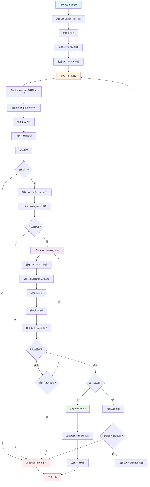
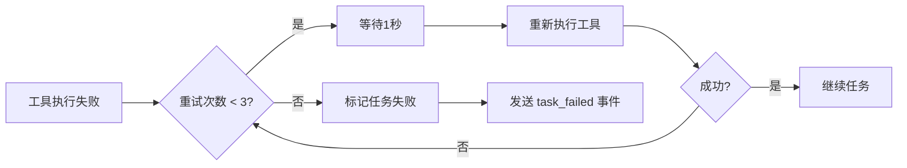
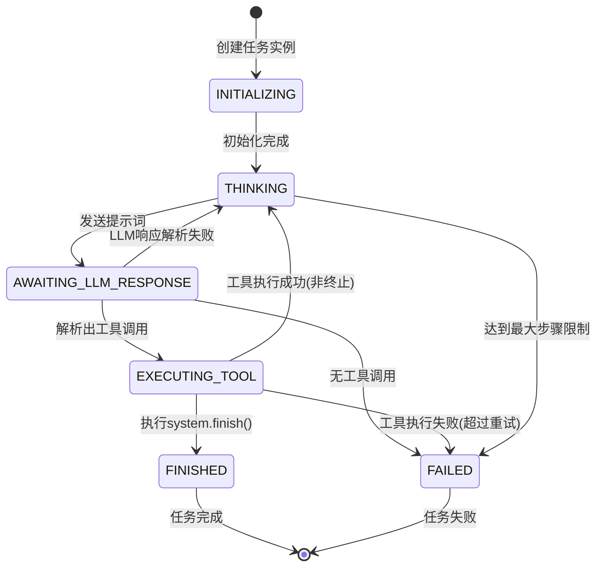

# 智能求职经纪人：完整执行流程图

本文档展示了智能求职经纪人从接收用户请求到完成任务的完整执行流程，包括各个组件之间的交互和状态转换。

## 流程图



## 详细执行步骤

### 1. 任务初始化阶段
```
用户请求 → 创建 JobSearchTask → 初始化组件 → 设置流式响应
```

**涉及组件:**
- `JobSearchTask` (主控制器)
- `ContextManager` (上下文管理)
- `JobToolExecutor` (工具执行器)
- `StatusNotifier` (状态通知器)

**流式通知:**
```json
{"eventType": "task_started", "timestamp": "...", "data": {"taskId": "job-search-123"}}
```

### 2. 思考循环阶段
```
构建提示词 → 调用 LLM → 解析响应 → 提取意图
```

**ContextManager 工作流:**
1. 收集用户画像、世界知识、历史记录
2. 检查上下文长度，必要时进行摘要
3. 构建结构化提示词
4. 发送给 LLM

**流式通知:**
```json
{"eventType": "thinking_started", "timestamp": "...", "data": {"message": "正在调用大语言模型..."}}
{"eventType": "thinking_ended", "timestamp": "...", "data": {"thinking": "我需要打开LinkedIn搜索页面"}}
```

### 3. 工具执行阶段
```
解析工具调用 → 执行浏览器操作 → 获取结果 → 更新历史
```

**JobToolExecutor 工作流:**
1. 解析工具代码字符串
2. 分发到具体工具实现
3. 调用 Playwright 执行浏览器操作
4. 捕获结果或错误
5. 格式化返回

**流式通知:**
```json
{"eventType": "tool_started", "timestamp": "...", "data": {"toolCode": "browser.navigate('https://linkedin.com/jobs')"}}
{"eventType": "tool_ended", "timestamp": "...", "data": {"toolCode": "browser.navigate(...)", "result": "成功导航到页面", "hasError": false}}
```

### 4. 循环控制逻辑

**继续条件:**
- 工具执行成功且非终止工具
- 步骤数未达到最大限制 (30步)
- 任务状态不是 FAILED

**终止条件:**
- LLM 调用 `system.finish()` 工具
- 连续工具执行失败
- 达到最大步骤限制
- LLM 响应解析失败

### 5. 错误处理机制



## 状态机转换图



## 组件交互时序图

```mermaid
sequenceDiagram
    participant Client as 客户端
    participant Task as JobSearchTask
    participant Context as ContextManager
    participant LLM as LLM API
    participant Executor as JobToolExecutor
    participant Browser as Playwright
    participant Notifier as StatusNotifier

    Client->>Task: 发起求职请求
    Task->>Notifier: 发送 task_started
    Notifier->>Client: 流式推送状态
    
    loop 思考-行动循环
        Task->>Context: 构建提示词
        Context-->>Task: 返回提示词
        Task->>Notifier: 发送 thinking_started
        Task->>LLM: 调用 API
        LLM-->>Task: 返回响应
        Task->>Notifier: 发送 thinking_ended
        
        opt 解析出工具调用
            Task->>Executor: 执行工具
            Executor->>Browser: 操作浏览器
            Browser-->>Executor: 返回结果
            Executor-->>Task: 返回工具输出
            Task->>Notifier: 发送 tool_executed
            Notifier->>Client: 流式推送状态
        else 解析出 system.finish
            Task->>Notifier: 发送 task_finished
            Notifier->>Client: 流式推送状态
            break
        else 其他情况
            Task->>Notifier: 发送 task_failed
            Notifier->>Client: 流式推送状态
            break
        end
        
        alt 任务成功
            Task->>Notifier: 发送 task_finished
            Notifier->>Client: 流式推送状态
        else 任务失败
            Task->>Notifier: 发送 task_failed
            Notifier->>Client: 流式推送状态
        end
    end
    
    Task->>Client: 返回最终结果
```

## 关键性能指标

- **平均任务执行时间**: 2-5 分钟
- **最大步骤限制**: 30 步
- **工具执行超时**: 30 秒
- **LLM 调用超时**: 60 秒
- **最大重试次数**: 3 次
- **上下文窗口限制**: 150,000 tokens

## 总结

这个执行流程确保了智能求职经纪人能够：
1. **可靠地执行**: 通过状态机和错误处理机制
2. **实时反馈**: 通过流式 HTTP 通知客户端
3. **智能决策**: 通过上下文管理和 LLM 推理
4. **高效操作**: 通过专业化的工具集
5. **安全终止**: 通过多重终止条件和限制机制
